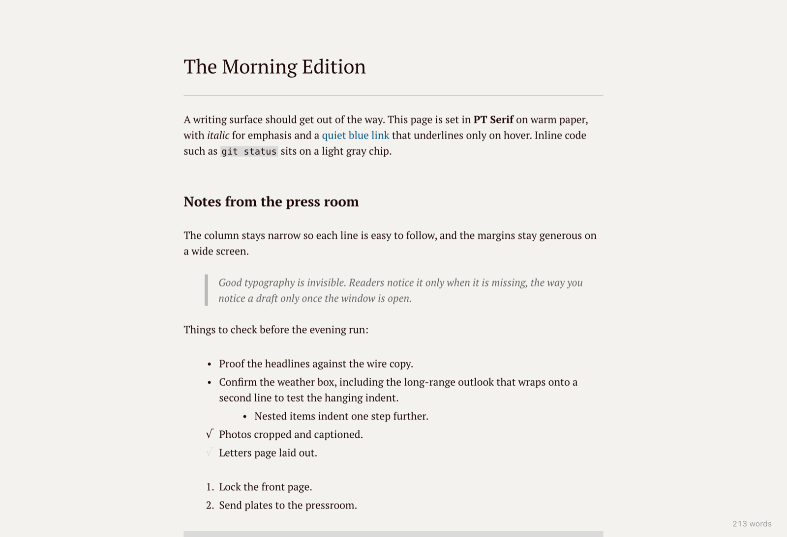

# OpenViewer

A Markdown editor for macOS that works like Typora and looks like its Newsprint theme: you write
and read in one view, and Markdown syntax disappears once you finish typing it.



## Features

- **One writing surface.** Headings, emphasis, links, lists, quotes, and code render in place. The
  Markdown markers reappear only while the cursor is inside them. ⌘/ switches to plain source.
- **Your file stays your file.** The text on disk is the document. Opening and saving without edits
  leaves every byte the same, including CRLF line endings and a UTF-8 BOM, and saves are atomic.
- **Tables you can edit in place.** Click a cell and type, Tab to move, and use the toolbar to add or
  remove rows and columns. Each edit changes only the lines it touches; **Tidy** lines up the columns.
- **Code blocks** in a dark card with syntax highlighting and a language picker.
- **Outline sidebar** (⇧⌘L), **focus mode** (F8), **typewriter mode** (F9), and a word count that
  counts Chinese, Japanese, and Korean characters as words.
- **Custom shortcuts.** Preferences (⌘,) lets you record a new shortcut for any menu or formatting
  command. They are saved to `keybindings.json`, which you can also edit by hand.
- Small and native: about 13 MB, one document per window, native menus and dialogs, and "Open With"
  from Finder.

## Build and run

You need macOS, [Node.js](https://nodejs.org) 24 (see `.node-version`), and a stable
[Rust](https://rustup.rs) toolchain.

```sh
npm install
npm run app:dev      # run the app with live reload
npm run app:build    # build src-tauri/target/release/bundle/macos/OpenViewer.app
```

The build is not signed with a Developer ID, so the first launch needs a right-click → Open.

## Test

```sh
npx playwright install webkit   # once
npm test                        # typecheck, Rust tests, browser suites, CSP check
npm run test:all                # the same, plus WebKit (the engine the app uses)
```

The browser suites run the editor in a plain browser against `npm run dev`.

## Security

OpenViewer treats every Markdown file as untrusted. The app can read and write only files you chose
(Open, Save As, drag and drop, or Open With), local images load only from the document's folder or git
repository, images from your local network are blocked, and a strict Content-Security-Policy applies.
Images from the internet still load when a document opens.

## How it works

OpenViewer is a [Tauri 2](https://tauri.app) app. The editor is
[CodeMirror 6](https://codemirror.net) with a live-preview layer that only adds decorations over
the Markdown text, so nothing is re-serialized when you save. Notes for contributors and coding
agents are in [AGENTS.md](AGENTS.md).

## Credits

- The look follows Typora's Newsprint theme. The CSS here is written from scratch.
- [PT Serif](https://fonts.google.com/specimen/PT+Serif) by ParaType, bundled under the
  [SIL Open Font License](public/fonts/OFL.txt).
- Built with Tauri, CodeMirror, and Lezer.
